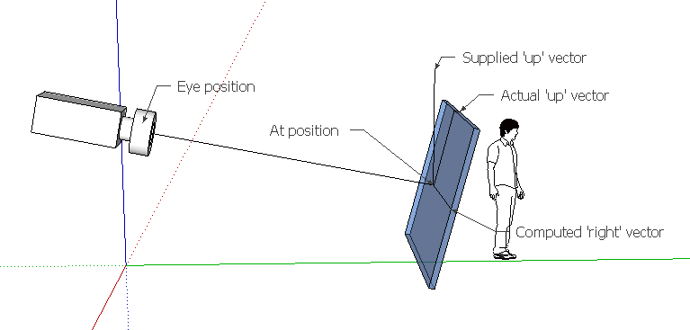
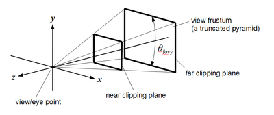

# OpenGL
# Lighting: 
## Types of Lighting: 
* Ambient illumination is light that's been scattered so much by the environment that its direction is impossible to determine - it seems to come from all directions. Backlighting in a room has a large ambient component, since most of the light that reaches your eye has first bounced off many surfaces. A spotlight outdoors has a tiny ambient component; most of the light travels in the same direction, and since you're outdoors, very little of the light reaches your eye after bouncing off other objects. When ambient light strikes a surface, it's scattered equally in all directions.

* The diffuse component is the light that comes from one direction, so it's brighter if it comes squarely down on a surface than if it barely glances off the surface. Once it hits a surface, however, it's scattered equally in all directions, so it appears equally bright, no matter where the eye is located. Any light coming from a particular position or direction probably has a diffuse component.

* Finally, specular light comes from a particular direction, and it tends to bounce off the surface in a preferred direction. A well-collimated laser beam bouncing off a high-quality mirror produces almost 100 percent specular reflection. Shiny metal or plastic has a high specular component, and chalk or carpet has almost none. You can think of specularity as shininess.

## Different Parameters: 

### GL_AMBIENT
params contains four integer or floating-point values that specify the ambient RGBA intensity of the light. Integer values are mapped linearly such that the most positive representable value maps to 1.0, and the most negative representable value maps to -1.0 . Floating-point values are mapped directly. Neither integer nor floating-point values are clamped. The initial ambient light intensity is (0, 0, 0, 1).

### GL_DIFFUSE
params contains four integer or floating-point values that specify the diffuse RGBA intensity of the light. Integer values are mapped linearly such that the most positive representable value maps to 1.0, and the most negative representable value maps to -1.0 . Floating-point values are mapped directly. Neither integer nor floating-point values are clamped. The initial value for GL_LIGHT0 is (1, 1, 1, 1); for other lights, the initial value is (0, 0, 0, 1).

### GL_SPECULAR
params contains four integer or floating-point values that specify the specular RGBA intensity of the light. Integer values are mapped linearly such that the most positive representable value maps to 1.0, and the most negative representable value maps to -1.0 . Floating-point values are mapped directly. Neither integer nor floating-point values are clamped. The initial value for **GL_LIGHT0 is (1, 1, 1, 1);** for other lights, the initial value is (0, 0, 0, 1).

### GL_POSITION
params contains four integer or floating-point values that specify the position of the light in homogeneous object coordinates. Both integer and floating-point values are mapped directly. Neither integer nor floating-point values are clamped.


# Misc Function: 

### gluLookat()

```
gluLookAt(camera[0], camera[1], camera[2], /* look from camera XYZ */ 
          0, 0, 0,  /* look at the origin */ 
          0, 1, 0); /* positive Y up vector */
```



Your image has an 'up' to it that can be separate from the world's up. The blue window in this image can be thought of as the 'near-plane' that your imagery is drawn on: your monitor, if you will. If all you supply is the eye-point and the at-point, that window is free to spin around. You need to give an extra 'up' direction to pin it down. OpenGL will normalize the vector that you supply if it isn't unit length. OpenGL will also project it down so that it forms a 90 degree angle with the 'z' vector defined by eye and at (unless you give an 'up' vector that is in exactly the same direction as the line from 'eye' to 'at'). Once 'in' (z) and 'up' (y) directions are defined, it's easy to calculate the 'right' or (x) direction from those two.

In this figure, the 'supplied' up vector is (0,1,0) if the blue axis is in the y direction. If you were to give (1,1,1), it would most likely rotate the image by 45 degrees because that's saying that the top of the blue window should be pointed toward that direction. Consequently the image of the guy would appear to be tipped (in the opposite direction).


### gluloadIdentity()

glLoadIdentity() is typically called immediately after a matrix mode change so you are starting "fresh" if you will. Matrix transforms such as the gluPerspective(), glOrtho(), glFrustum(), glRotate(), glMultMatrix(), glTranslate() are cumulative operations because they aggregate to allow you to describe complex 3D world space transforms or to describe your OpenGL viewing volume. Example: if I want a cube translated in the +X direction then rotated around the Z axis I issue a glRotate() followed by a glTranslate().
glLoadIdentity() wipes out the matrix (of the current matrix mode) with the identity matrix so following a gluPerspective() by glLoadIdentity() is equivalent to a single call to glLoadIdentity(). In other words, that sequence is nonsensical.

### gluperspective(degree of view, AR, z_near, z_far)



The purpose of the 4 parameters is to define a view frustum, like above where nothing outside of the frustum should be is visible on screen ( To accomplish this, the parameters are used to calculate a 4x4 matrix, which is then used to transform each vertex into the so-called clip space. There, testing if a vertex is inside the frustum or not is trivial )
**The field of view parameter** is basically the angle in between a plane passing through the camera position as well as the top of your screen & another plane passing through the camera position and the bottom of your screen. The bigger this angle is, the more you can see of the world - but at the same time, the objects you can see will become smaller.
**The aspect ratio** is your viewport's aspect ratio. ( In the graphic above, the viewport is located at the the near clipping plane ) Being able to define it at will makes sense, since your viewport's aspect ratio may vary.
**The zNear & zFar values** define the distance between the camera position & the near and far clipping planes, respectively. Nothing that's closer to the camera than zNear or farther away than zFar will be visible. Both values must be > 0, and obviously, zFar > zNear. zFar should ideally be chosen so that everything you want to render is visible, but making it larger than necessary wastes depth buffer prescision & may lead to flickering effects, called z-fighting. Likewise, setting zNear too close to the camera may cause the same effect - in fact, having a reasonable zNear value is more important than zFar. If you want to know exactly why this happens, you should read some in-depth explanations, like this one or this one

